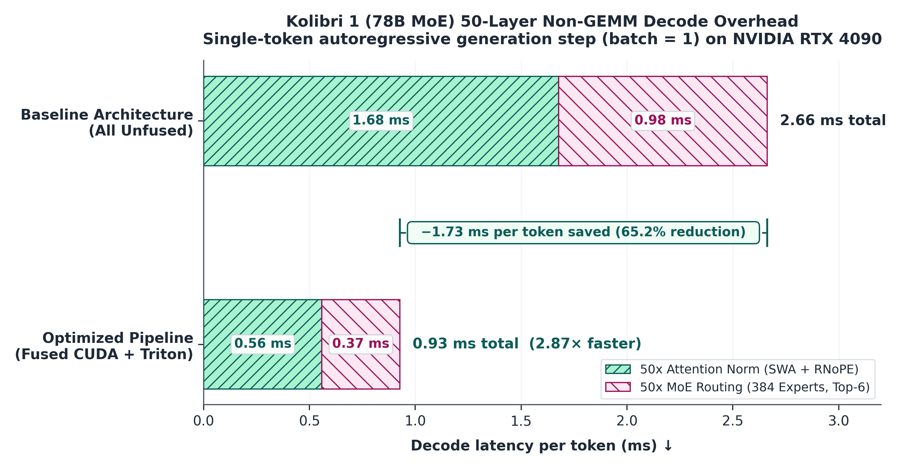
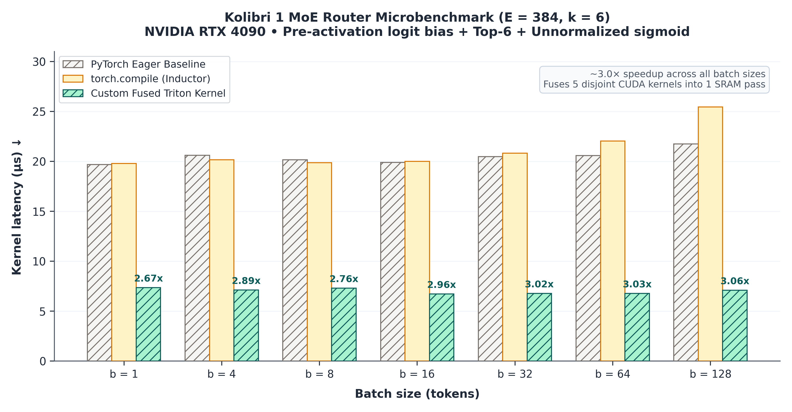
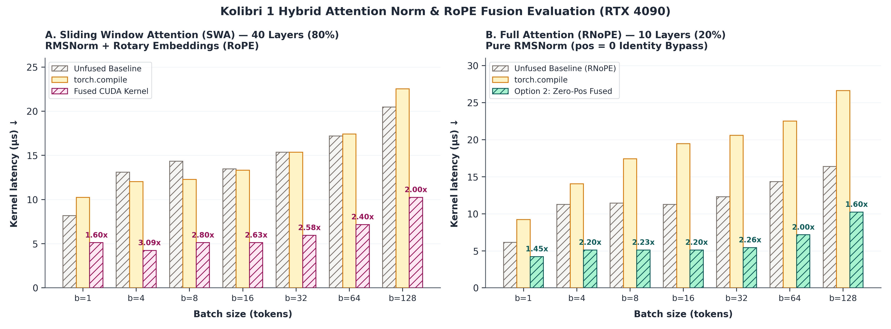

# Kolibri 1 MoE Inference Profiling & Kernel Evaluation

An empirical performance analysis and kernel design study for deploying **Aleph Alpha's Kolibri 1 (78B MoE)** architecture in **NVIDIA TensorRT-LLM**.

This repository investigates whether writing custom monolithic C++/CUDA kernels is strictly required for Kolibri's non-standard routing and attention layers, or if lighter execution paths (PyTorch compiled, Triton kernels, separated routing) offer comparable throughput with significantly reduced engineering overhead.

---

## Background & Architecture Divergence

When integrating Kolibri 1 into TensorRT-LLM, standard fused C++/CUDA kernels fail due to mathematical and architectural differences:

### 1. MoE Routing ($E = 384$, $k = 6$)
* **Logit-Space Bias:** Kolibri adds bias directly to raw logits (`scores = x + bias`) prior to Top-K selection. Existing TRT-LLM fused kernels (e.g., `MiniMax2`) apply bias in post-sigmoid space (`sigmoid(x) + bias`), which yields mathematically divergent expert rankings.
* **Unnormalized Sigmoids:** Kolibri assigns weights as `topk_weights = sigmoid(x[topk_ids])` where weights do not sum to 1 ($\sum w_i \neq 1$). TRT-LLM's `SigmoidRenorm` kernel strictly enforces sum normalization ($\sum w_i = 1$).
* **Expert Count Cap:** Built-in CUDA policy traits (`RoutingCustomPolicy.cuh`) specify a hard compilation limit of `Tier<128, 8>` ($E \le 128$). Kolibri uses 384 experts.

### 2. Attention Layer Structure
* **Interleaved SWA / RNoPE:** Kolibri alternates between Sliding Window Attention (with RoPE + RMSNorm) and Full Attention without rotary embeddings (RMSNorm only).
* **Fused Kernel Assertion:** TRT-LLM's `fusedQKNormRopeKernel.cu` does not support skipping RoPE while retaining per-head RMSNorm (`assert not (fuse_qk_norm_rope and skip_rope)`).

---

## Research Question

> **Can we fuse Kolibri's MoE routing operations (logit bias + top-k + unnormalized sigmoid) into a single CUDA/Triton kernel instead of relying on PyTorch's requires_separated_routing = True?**

- **Context**: Kolibri 1 routes tokens across 384 experts by adding an `e_score_correction_bias` directly to raw logits, selecting top-k (k=6), and applying an unnormalized sigmoid activation ($\sum w_i \neq 1$).
- **Challenge**: Existing trtllmGen routing kernels (`SigmoidRenorm` and `MiniMax2`) either force sum-to-1 normalization, do not support pre-activation logit biases, or are constrained to $\le 128$ experts.
- **Investigation**: Does profiling show that the 4 separate PyTorch operations create kernel launch overhead during decoding, and would extending trtllmGen with a (LogitBias -> TopK -> SigmoidNoNorm) policy (or a custom Triton kernel) yield measurable end-to-end latency gains?

> **Can the attention layer leverage fuse_qk_norm_rope = True despite Kolibri's alternating hybrid schedule (Sliding-Window with RoPE vs. Full-Attention with RNoPE)?**

- **Context**: Kolibri alternates every 5 layers: 4 Sliding-Window Attention (SWA) layers that apply rotary embeddings (RoPE), and 1 Full-Attention layer that skips RoPE completely (RNoPE).
- **Challenge**: The current CUDA kernel (`fusedQKNormRopeKernel.cu`) enforces `assert not (fuse_qk_norm_rope and skip_rope)`, disallowing normalization without rotation.
- **Investigation**: Can we either safely enable `fuse_qk_norm_rope = not self.is_full_attention` selectively on the 4 SWA layers, or add a pass-through bypass flag to `fusedQKNormRopeKernel.cu` so that all layers can benefit from single-pass SRAM fusion without crashing on RNoPE layers?

---

## Project Structure

```text
profiling-moe/
├── assets/                          # Publication-grade benchmark figures
│   ├── 01_router_microbenchmark.png
│   ├── 02_hybrid_attention_norm.png
│   └── 03_end_to_end_decode_impact.png
├── benchmarks/
│   ├── 01_benchmark_router.py
│   ├── 02_benchmark_attention_norm.py
│   ├── 02_verify_attention_norm.py
│   ├── 02_verify_zero_position_rnope.py
│   ├── generate_figures.py          # Reproducible figure rendering pipeline
│   └── results/                     # Auto-generated JSON benchmark results
│       ├── 01_router_results.json
│       └── 02_attention_results.json
├── kernels/                         # Custom Triton/CUDA kernel implementations
│   └── fused_kolibri_router.py
├── traces/                          # NVIDIA Nsight Systems (.nsys-rep) captures
├── docs/                            # Deep-dive architectural analyses & IR proofs
│   ├── 01_router_fusion.md
│   └── 02_hybrid_attention.md
├── config.json                      # Kolibri 1 model architectural configuration
├── requirements.txt
└── README.md
```

---

## Investigation Progress & Results

| # | Investigation | Target Layer | Eager Baseline | `torch.compile` | Custom / Fused Kernel | Deep-Dive Doc |
|:---:|:---|:---|:---:|:---:|:---:|:---|
| **01** | **MoE Router Fusion** | Logit Bias + Top-6 ($E=384$) | 17.41 µs | 16.38 µs (1.06x) | **5.12 µs (3.40x)** (New Triton Kernel) | [01_router_fusion.md](file:///home/mkina/profiling/profiling-moe/docs/01_router_fusion.md) |
| **02** | **Hybrid Attention Norm** | SWA RoPE + RNoPE (50 layers) | 1.68 ms | N/A (regressed) | **0.56 ms (3.00x)** (Existing CUDA Kernel) | [02_hybrid_attention.md](file:///home/mkina/profiling/profiling-moe/docs/02_hybrid_attention.md) |



---

## Key Findings & Benchmark Summary

### Investigation 01: MoE Router Fusion
- **Problem**: PyTorch Eager and `torch.compile` split Kolibri's logit-space bias + Top-6 ($E=384$) + unnormalized sigmoid into 5 sequential CUDA kernels (`add`, `gatherTopK`, `bitonicSort`, `gather`, `sigmoid`), generating intermediate memory roundtrips and an irreducible ~16–19 µs launch latency floor.
- **Solution**: Implemented a fused Triton kernel ([kernels/fused_kolibri_router.py](file:///home/mkina/profiling/profiling-moe/kernels/fused_kolibri_router.py)) that computes bias addition, iterative Top-6 extraction, and unnormalized sigmoid entirely in SRAM/registers in a single pass.
- **Microbenchmark Results (RTX 4090)**:
  - **Macro Latency (`do_bench`)**: Reduced from **17.41 µs** (Eager) to **5.12 µs** (**3.40x end-to-end speedup**).
  - **Silicon Execution (Nsight Systems)**: Raw SM kernel runtime dropped from **19.51 µs** (sum of 5 kernels) to **1.87 µs** (**10.4x raw kernel speedup**).
- **End-to-End Impact**: In Kolibri 1 (50 MoE layers), saving ~11.3–13.5 µs per layer recovers **~0.565–0.675 ms per generated token** during decode (~6–8% total decode latency reduction).
- **Upstream Path**: Ready for integration as a pure Triton routing module in TensorRT-LLM without requiring complex C++/CUDA template modifications. Check the [deep-dive report](file:///home/mkina/profiling/profiling-moe/docs/01_router_fusion.md) for full details.



### Investigation 02: Hybrid Attention Norm & RoPE Fusion
- **Problem**: Kolibri 1 interleaves 40 Sliding Window Attention (SWA with RoPE) layers and 10 Full-Attention (RNoPE without rotary embeddings) layers. TensorRT-LLM globally disables single-pass QK-Norm + RoPE fusion (`fuse_qk_norm_rope = False`) because `qk_norm_attention.py` hardcodes `assert not (fuse_qk_norm_rope and skip_rope)`. This forces all 50 layers into an unfused fallback path dispatching 3 separate CUDA kernels (`q_norm` + `k_norm` + `apply_rope`) per layer with high launch overhead and DRAM bandwidth penalties.
- **Root Cause & Framework Oversight**: The TRT-LLM framework assertion is overly conservative. When `skip_rope=True`, the framework could simply clamp `position_ids` to zero (`position_ids = torch.zeros_like(...)`). Because $\cos(0) = 1$ and $\sin(0) = 0$, the RoPE rotation matrix becomes the exact identity matrix ($R = I$). The C++ kernel ([fusedQKNormRopeKernel.cu](file:///home/mkina/profiling/TensorRT-LLM/cpp/tensorrt_llm/kernels/fusedQKNormRopeKernel.cu)) executes pure per-head RMSNorm at full fused speed without requiring any C++ kernel modifications or raising assertions.
- **Solutions Validated**:
  - **Option 1 (Layer-Selective Fusion)**: Configure `fuse_qk_norm_rope = not self.is_full_attention` in `modeling_kolibri.py`. 40 SWA layers run fused, while 10 Full-Attention layers take the clean fallback path.
  - **Option 2 (Zero-Position Workaround)**: Pass `position_ids = 0` to Full-Attention layers, unlocking the fused C++ kernel for all 50 layers with bit-exact numerical parity.
- **Microbenchmark Results (RTX 4090)**:
  - **SWA Layers (40 layers)**: Fused CUDA kernel runs in **4.24–5.12 µs** vs **13.09–20.48 µs** unfused (**2.0x–3.1x speedup**).
  - **Full-Attention Layers (10 layers)**: Zero-position fused kernel runs in **4.22–5.12 µs** vs **11.26–16.38 µs** unfused (**1.6x–2.2x speedup**).
  - **50-Layer Stack (Decode Token Latency)**: Total attention norm time dropped from **1.678 ms** to **0.559 ms** (**3.00x end-to-end speedup**).
- **End-to-End Impact**: Saves **~1.12 ms per generated token** during decoding across the 50-layer model.
- **Upstream Path**: Either adopt layer-selective fusion in `modeling_kolibri.py` or upstream the zero-position identity bypass directly into `qk_norm_attention.py`. Check the [deep-dive report](file:///home/mkina/profiling/profiling-moe/docs/02_hybrid_attention.md) for full details.

