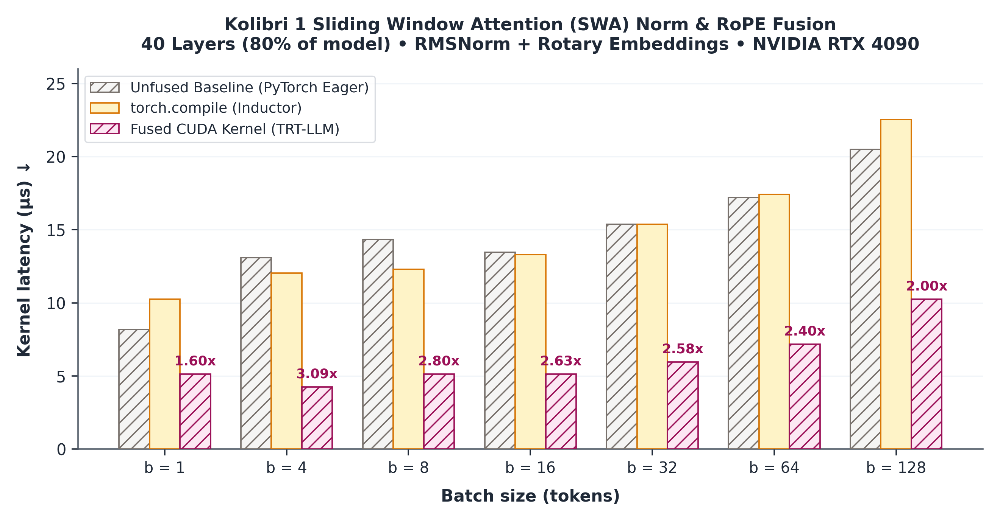
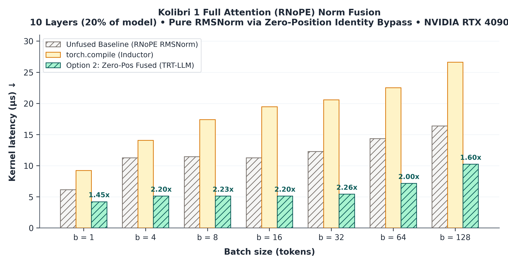

# 02: Kolibri Hybrid Attention Norm & RoPE Fusion Analysis

- **Investigation Date**: 2026-10-05
- **Hardware Target**: NVIDIA GeForce RTX 4090 (24 GB VRAM, 128 SMs, 72 MB L2 cache)
- **Software Stack**: PyTorch 2.14.0+cu130, TensorRT-LLM, Python 3.10
- **Model Target**: Aleph Alpha's Kolibri 1 (78B MoE, 50 layers, $H_q=48, H_{kv}=4, d=128$)

---

## 1. Research Question

> **Can Kolibri 1's alternating hybrid attention schedule (40 SWA layers with RoPE + 10 Full-Attention layers with RNoPE) leverage TensorRT-LLM's single-pass fused QK-Norm+RoPE kernel without crashing on RNoPE layers?**

### Architectural Background & Divergence

Kolibri 1 repeats a **4:1 hybrid attention schedule** across its 50 transformer layers:
* **40 Sliding Window Attention (SWA) layers** (`is_full_attention = False`):
  * Attention window: $513$ tokens.
  * Positional encoding: RoPE (GPT-NeOX format, $\theta = 10000.0$).
  * Normalization: Per-head RMSNorm on Query ($48 \times 128$) and Key ($4 \times 128$) with $\epsilon = 10^{-6}$.
* **10 Full Attention layers** (`is_full_attention = True`):
  * Attention window: Full context ($262,144$ max position embeddings).
  * Positional encoding: **No Positional Encoding (RNoPE)**; positions remain unrotated.
  * Normalization: Per-head RMSNorm on Query and Key with $\epsilon = 10^{-6}$.

---

## 2. Technical Root Cause in TensorRT-LLM

In standard TensorRT-LLM, `modeling_kolibri.py` hardcodes:
```python
fuse_qk_norm_rope = False
```

### The 3 Bottlenecks:
1. **Framework Assertion (Overly Conservative)**: [tensorrt_llm/_torch/attention/qk_norm_attention.py](file:///home/mkina/profiling/TensorRT-LLM/tensorrt_llm/_torch/attention/qk_norm_attention.py#L184) enforces:
   ```python
   assert not (fuse_qk_norm_rope and skip_rope), "Fusing qk norm and skipping rope is not supported"
   ```
   Passing `fuse_qk_norm_rope = True` globally crashes on all 10 Full-Attention layers.
   > **Framework Oversight**: This assertion is overly conservative. The framework could have intercepted `skip_rope=True` and clamped `position_ids` to zero (`position_ids = torch.zeros_like(...)`). Because $\cos(0) = 1$ and $\sin(0) = 0$, the RoPE rotation matrix reduces to the identity matrix ($R = I$), effectively converting the fused kernel into a pure per-head RMSNorm without requiring any C++ kernel modifications or raising a fatal assertion.
2. **CUDA Kernel Monolith**: [fusedQKNormRopeKernel.cu](file:///home/mkina/profiling/TensorRT-LLM/cpp/tensorrt_llm/kernels/fusedQKNormRopeKernel.cu) hardcodes RoPE calculations directly into the register pipeline following RMSNorm without a `skip_rope` parameter. Setting `rotary_dim = 0` causes division by zero in frequency calculations.
3. **Unfused Fallback Cost**: When `fuse_qk_norm_rope = False`, all 50 layers dispatch **3 disjoint CUDA kernels** (`q_norm` + `k_norm` + `apply_rope`) with intermediate DRAM roundtrips.

---

## 3. Option 1: Layer-Selective Fusion

Instead of global boolean flags, we configure fusion conditionally per layer in [modeling_kolibri.py](file:///home/mkina/profiling/TensorRT-LLM/tensorrt_llm/_torch/models/modeling_kolibri.py):

```python
fuse_qk_norm_rope = not self.is_full_attention
```

### Execution Behavior:
* **40 SWA Layers (80%)**: Run `torch.ops.trtllm.fused_qk_norm_rope` in a single CUDA kernel with register persistence.
* **10 Full-Attention Layers (20%)**: Take the unfused PyTorch fallback path, cleanly skipping RoPE without assertion errors.

---

## 4. Option 2: Zero-Position Workaround

For the 10 Full-Attention layers, using the Unfused fallback is computationally wasteful. We can trick the fused C++ kernel into performing a pure RMSNorm by exploiting the mathematics of RoPE.

If we pass an array of all zeros as the `position_ids`, the RoPE angle computation yields $\theta = 0$. Since $\cos(0) = 1$ and $\sin(0) = 0$, the RoPE rotation matrix becomes the identity matrix:
$$R(\theta=0) = \begin{pmatrix} \cos(0) & -\sin(0) \\ \sin(0) & \cos(0) \end{pmatrix} = \begin{pmatrix} 1 & 0 \\ 0 & 1 \end{pmatrix} = I$$

The `fusedQKNormRopeKernel` applies the RMSNorm and then multiplies the normalized vectors by the identity matrix, effectively bypassing the rotation entirely ($x \cdot I = x$).

This allows us to leverage the highly-optimized C++ kernel (and its ~2.2x speedup) even for the RNoPE layers, without triggering division-by-zero or requiring C++ kernel modifications.

### Numerical Equivalence Proof & Verification Results

Tested across batch sizes `[1, 4, 16, 64]` via [`benchmarks/02_verify_zero_position_rnope.py`](file:///home/mkina/profiling/profiling-moe/benchmarks/02_verify_zero_position_rnope.py) and [`benchmarks/02_verify_attention_norm.py`](file:///home/mkina/profiling/profiling-moe/benchmarks/02_verify_attention_norm.py):

| Batch Size | Max $\Delta Q$ (vs Pure RMSNorm) | Max $\Delta K$ (vs Pure RMSNorm) | Max $\Delta V$ (Pass-through) | Status |
| :---: | :---: | :---: | :---: | :---: |
| **1** | `0.000000` | `0.000000` | `0.000000` | **MATCH (Bit-exact)** |
| **4** | `0.000000` | `0.000000` | `0.000000` | **MATCH (Bit-exact)** |
| **16** | `0.000000` | `0.000000` | `0.000000` | **MATCH (Bit-exact)** |
| **64** | `0.000000` | `0.000000` | `0.000000` | **MATCH (Bit-exact)** |

* **Contrast Check**: When non-zero position IDs are supplied ($\text{pos} > 0$), rotation divergence $\Delta Q > 0.1$, confirming that non-zero positions rotate the coordinates while zero positions mathematically collapse into the pure RMSNorm identity.

---

## 5. Verification Matrix

The verification scripts [[benchmarks/02_verify_attention_norm.py](file:///home/mkina/profiling/profiling-moe/benchmarks/02_verify_attention_norm.py)] and [[benchmarks/02_verify_zero_position_rnope.py](file:///home/mkina/profiling/profiling-moe/benchmarks/02_verify_zero_position_rnope.py)] validate:

| Test Case | Description | Target |
| :--- | :--- | :--- |
| **Test 1** | Numerical equivalence between fused C++ CUDA kernel and PyTorch eager on SWA layers. | `assert_close` atol $\le 2\times 10^{-2}$ (bf16) |
| **Test 2** | Full-Attention RNoPE verification (Q/K normalized, RoPE rotation skipped). | Pure RMSNorm match |
| **Test 2b** | Option 2 equivalence: Fused kernel with `position_ids = 0` vs Pure RMSNorm. | Bit-exact match (`0.000000`) |
| **Test 3** | Layer-selective initialization across all 50 layers. | Zero assertion errors |
| **Test 4** | End-to-end 50-layer sequential forward execution in decode ($b=1$) and prefill ($b=16$). | Output shapes valid |

---

## 6. Benchmark Results

Microbenchmarks were run across `[1, 4, 8, 16, 32, 64, 128]` batch sizes on a single RTX 4090.

### SWA Layers (40 Layers)
- **Unfused Fallback**: 13.31µs - 20.48µs (for typical batch sizes 4-128).
- **Fused CUDA Kernel**: 4.24µs - 10.24µs.
- **Speedup**: **~2.0x to 3.1x** speedup across all tested batch sizes.



### Full-Attention Layers (10 Layers)
- **Unfused Fallback**: 11.26µs - 16.38µs.
- **Option 2 (Zero-Position Fused)**: 4.22µs - 10.24µs.
- **Speedup**: **~1.6x to 2.2x** speedup over the PyTorch `RMSNorm` baseline. `torch.compile` was also tested but proved to be slower than the eager baseline (due to graph dispatch overheads on a single op).



### Overall Decode Preprocessing (50-Layer Stack)
For a single generation step:
- **Baseline (All Unfused)**: 1678.34 µs (1.678 ms)
- **Layer-Selective / Fused (Option 1/2)**: 559.10 µs (0.559 ms)
- **Overall Speedup**: **3.00x faster**.

**Impact**: This optimization saves **~1.12 ms per token**.